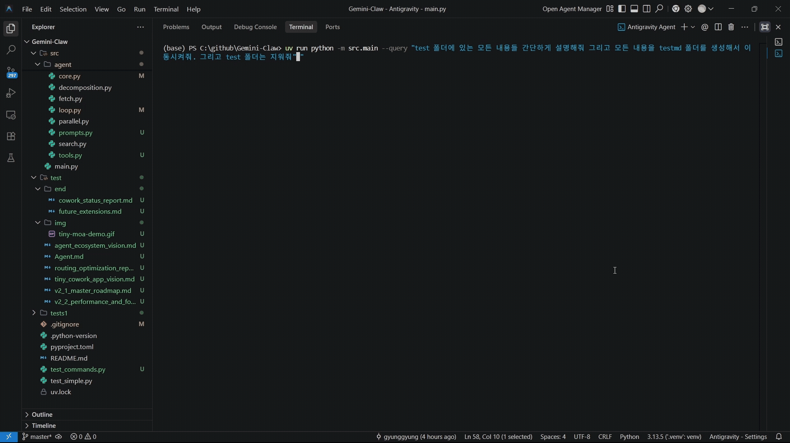

🇰🇷 한국어 | [🇺🇸 English](README_EN.md)

# Gemini-Claw

**Gemini-Claw**는 Google DeepMind의 Gemini 모델을 기반으로 한 차세대 자율 에이전트(Autonomous Agent) 플랫폼입니다. 
단순한 챗봇을 넘어, 복잡한 연구 주제를 스스로 분석(Decomposition)하고, 웹에서 정보를 수집(Search & Fetch)하며, 로컬 시스템을 제어(System Control)하여 결과물을 만들어내는 **"Autonomous Research & Synthesis Engine"**입니다.

## 🚀 프로젝트 비전

> "Give it a goal, and it claws its way to the answer."

Gemini-Claw는 사용자의 모호한 요청을 구체적인 실행 계획으로 변환하고, 최소한의 개입으로 최적의 결과를 도출하는 것을 목표로 합니다.

## ✨ 주요 기능 (Key Features)

### 1. 🧠 자율 연구 및 합성 (Autonomous Research)
- **Deep Research**: 사용자의 질문을 심층 분석하여 다각도에서 정보를 수집합니다.
- **Query Decomposition**: 복잡한 질문을 여러 개의 구체적인 검색 쿼리로 자동 분해(`src/agent/decomposition.py`)하여 정보의 정확도를 높입니다.
- **Intelligent Fetch**: 검색된 URL의 본문을 직접 읽고(`web_fetch`), 필요한 정보만 추출하여 요약합니다.

### 2. 🛠️ 안전한 시스템 제어 (Safe System Operations)
Agent는 독자적인 Python Tool Loop(`src/agent/loop.py`)를 통해 로컬 환경을 안전하게 제어합니다.
- **File System**: `ls`, `mkdir`, `read_file`, `write_file` 등을 통해 프로젝트 구조를 관리합니다.
- **Git Integration**: 코드 변경 사항을 `git status`, `add`, `commit` 등으로 직접 관리합니다.

### 3. ⚡ 최적화된 아키텍처 (Optimized Architecture)
- **Parallel Execution**: 병렬 처리(`src/agent/parallel.py`) 인프라를 갖추어 다중 작업을 효율적으로 수행합니다.
- **Native Python Loop**: 무거운 프레임워크 대신 가볍고 빠른 Python 네이티브 루프를 구현하여 반응 속도를 최적화했습니다.
- **CLI Interaction**: Google의 `gemini-cli`와 긴밀하게 통합되어 최신 모델(Gemini 2.5/3.0)의 성능을 100% 활용합니다.

## 📂 프로젝트 구조 (Project Structure)

```
Gemini-Claw/
├── src/
│   ├── agent/
│   │   ├── core.py          # Gemini CLI 래퍼 및 세션 관리
│   │   ├── loop.py          # 메인 에이전트 루프 (Re-Act 패턴 구현)
│   │   ├── tools.py         # 안전한 시스템 명령어 도구 모음
│   │   ├── search.py        # 웹 검색 모듈
│   │   ├── fetch.py         # 웹 콘텐츠 수집 모듈
│   │   └── decomposition.py # 쿼리 분해 및 분석 모듈
│   └── main.py              # 애플리케이션 진입점
├── docs/                    # 문서화 (계획 및 가이드)
│   └── demo/                # 데모 GIF
├── test_commands.py         # 기능 검증 테스트 스크립트
└── README.md                # 프로젝트 설명서
```

## 🚀 시작하기 (Getting Started)

### 환경 설정
본 프로젝트는 **`uv`** 패키지 매니저를 권장합니다.
- Python 3.10 이상
- `gemini-cli` 설치 및 인증 필요

### 설치
```bash
git clone https://github.com/gyunggyung/Gemini-Claw.git
cd Gemini-Claw
uv sync
```

### 실행

**1. 기본 실행**
```bash
uv run python -m src.main --query "최신 AI 트렌드를 조사해서 리포트로 작성해줘"
```

**2. 복잡한 검색 (Deep Research)**
```bash
uv run python -m src.main --query "최신 AI 업계 동향 분석: OpenAI, Nvidia, Amazon의 투자/갈등/협력 관계를 중심으로 조사해줘. 그리고 딥마인드와 앤트로픽에 관련된 소식들도 알려줘. Reddit이나 Hacker News의 여론도 포함해서 인공지능 거품론에 대해 심층적으로 다뤄 줘. URL 포함 필수."
```


**3. 파일 조작 (System Control)**
```bash
uv run python -m src.main --query "test 폴더에 있는 모든 내용들 간단하게 설명해줘 그리고 모든 내용을 testmd 폴더를 생성해서 이동시켜줘. 그리고 test 폴더는 지워줘"
```


## 📜 라이센스 (License)

이 프로젝트는 [Apache License 2.0](LICENSE) 하에 배포됩니다.
